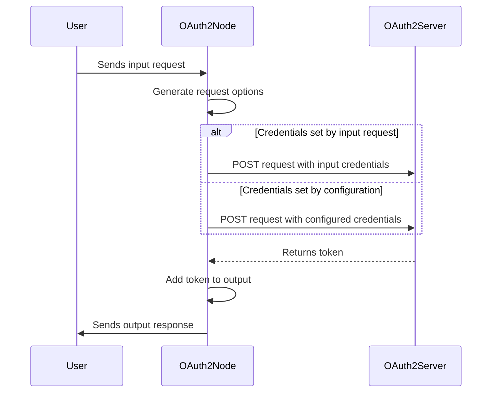

[](https://www.paypal.com/donate?hosted_button_id=FLB35ANBK99ZA)
 


  node-red-contrib-oauth2
  =================
  The `node-red-contrib-oauth2` is a Node-RED node that provides an OAuth2 authentication flow. This node uses the OAuth2 protocol to obtain an access token, which can be used to make authenticated API requests.


  # Install

  You can install this node directly from the Node-RED editor by going to the Manage Palette menu and searching for "node-red-contrib-oauth2". Alternatively, you can install it using npm:  
  
  ```bash
  $ cd ~/.node-red
  $ npm install node-red-contrib-oauth2
  ```

  # Usage
  
  
  The node requires an access token URL and a set of client credentials to authenticate with that URL. The node will generate an HTTP request to the access token URL to retrieve the access token using the client credentials.
  The access token can be stored in a message property that can be used by subsequent nodes in a flow.
  
  The node provides two modes of operation:
  
   1. Static credentials: The client credentials can be set in the node configuration page.
   2. Dynamic credentials: The client credentials can be sent as part of the message payload to the node.


# Inputs


| Input                          | Type           | Description                                                                                                           |
| ------------------------------| --------------| --------------------------------------------------------------------------------------------------------------------- |
| container                      | string         | This refers to the name of the container that is intended to receive the message object. By default, it is set to oauth2Response. |
| grant type                     | object         | This specifies the grant type used to obtain the access token.                                                        |
| access token url               | string         | This is the URL used to obtain the access token.                                                                      |
| client id                      | string         | This is the unique identifier for the client application.                                                             |
| client secret                  | string         | This is the secret key used to authenticate the client application.                                                   |
| username                       | string         | This is the username used for authentication. **Grant Type:** `password`                                              |
| password                       | string         | This is the password used for authentication. **Grant Type:** `password`                                              |
| authorization endpoint         | string         | This is the URL of the authorization endpoint. **Grant Type:** `authorization code`                                   |
| code (read only)               | string         | This is the authorization code. **Grant Type:** `authorization code`                                                  |
| scope                          | string         | This specifies the scope of the access request.                                                                       |
| use proxy                      | boolean        | This specifies whether to use a proxy or not.                                                                         |
| Proxy Configuration            | object         | This specifies the configuration for the proxy. **User Proxy:** `true`                                                |
| only send non-2xx responses to catch node | boolean | This specifies whether to only catch non-2xx responses.                                                           |
| embedded credentials           | boolean        | This specifies whether to include the client credentials in the token request body for authentication purposes.       |
| reject Unauthorized            | boolean        | This specifies whether to reject unauthorized requests. The rejectUnauthorized parameter controls SSL/TLS certificate validation for the server, with true enforcing validation and false disabling it. |


# Outputs

| Output           | Description                                                                                           |
|------------------|-------------------------------------------------------------------------------------------------------|
| access_token     | This is the access token obtained from the OAuth2 server.                                            |
| expires_in       | This is the duration of time, in seconds, until the access token expires.                            |
| token_type       | This is the type of the token. For example, "Bearer".                                                 |
| scope            | This specifies the scope of the access granted by the token obtained.                                |
| refresh_token    | This is the refresh token that can be used to obtain a new access token before the current one expires.|


# Details

The `msg.oauth2Request` object contains the OAuth2 request details that are set by the node. The following are the different types of credentials that can be used for authentication:


### `Client Credentials`

The client credentials can be sent as part of the message payload to the node. The `msg.oauth2Request.credentials` object should contain the following properties:

* `grant_type` (string): This specifies the grant type. For dynamic credentials, the value should be set to "client_credentials".
* `client_id` (string): This is the client ID of the OAuth2 client.
* `client_secret` (string): This is the client secret of the OAuth2 client.
* `scope` (string): This specifies the scope of the access requested.

Here's an example:
```js
msg.oauth2Request = { 
    "access_token_url": "http://localhost:8080/v1/oauth/tokens",
    "credentials": {
        "grant_type": "client_credentials",
        "client_id": "test_client_1",
        "client_secret": "test_secret",
        "scope": "read_write"
    },
};
return msg;
```

### `Password`

The username and password can be sent as part of the message payload to the node. The `msg.oauth2Request.credentials` object should contain the following properties:

* `grant_type` (string): This specifies the grant type. For password credentials, the value should be set to "password".
* `client_id` (string): This is the client ID of the OAuth2 client.
* `client_secret` (string): This is the client secret of the OAuth2 client.
* `scope` (string): This specifies the scope of the access requested.
* `username` (string): This is the username of the user.
* `password` (string): This is the password of the user.

Here's an example:
```js
msg.oauth2Request = {
    "access_token_url": "http://localhost:8080/v1/oauth/tokens",
    "credentials": {
        "grant_type": "password",
        "client_id": "test_client_1",
        "client_secret": "test_secret",
        "scope": "read_write",
        "username": "test@user",
        "password": "test_password"
    },
};
return msg;
```

### `refreshToken`

A refresh token can be used to obtain a new access token without requiring the user to re-authenticate. The `msg.oauth2Request.credentials` object should contain the following properties:

* `grant_type` (string): This specifies the grant type. For refresh token credentials, the value should be set to "refresh_token".
* `client_id` (string): This is the client ID of the OAuth2 client.
* `client_secret` (string): This is the client secret of the OAuth2 client.
* `scope` (string): This specifies the scope of the access requested.
* `refresh_token` (string): This is the refresh token obtained from a previous authentication.

Here's an example:
```js
let refreshToken = global.get('refreshToken');

msg.oauth2Request = { 
    "access_token_url": "http://localhost:8080/v1/oauth/tokens",
    "credentials": {
        "grant_type": "refresh_token",
        "client_id": "test_client_1",
        "client_secret": "test_secret",
        "scope": "read_write",
        "refresh_token": refreshToken   
    },
};
return msg;
```

# References
- `RFC 6749` - [The OAuth 2.0 Authorization Framework](https://www.rfc-editor.org/rfc/rfc6749) 
- `RFC 5849` - [The OAuth 1.0 Protocol](https://www.rfc-editor.org/rfc/rfc5849)


# Contributors
<table>
  <tr>
    <td>
      <a href="https://github.com/caputomarcos/node-red-contrib-oauth2/graphs/contributors">
        
      </a>
     </td>
  </tr>
</table>
